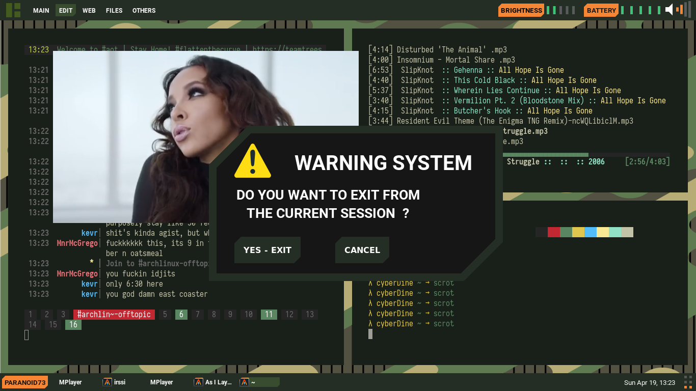

<b>Awesome wm</b> Military style

## Description

[Awesome Wm](https://awesomewm.org/) configuration , inspired
[Everfree-TEC-design](https://www.behance.net/gallery/79573713/Everfree-TEC-design) and By [Worron's Awesome wm config](https://github.com/worron/awesome-config)
. This configuration is compatible with awesome WM 4.0 and newer.

## Dependencies

- [Redshift-gtk](https://github.com/jonls/redshift)
- [Alacritty](https://github.com/alacritty/alacritty)
- [maim](https://github.com/naelstrof/maim)
- [compton](https://github.com/chjj/compton)
- light-locker
- notify-send
- nm-applet

## Installation

     git clone https://github.com/paranoid73/AwesomeWm-config.git ~/.config/awesome --recursive

## Note:

     In order to prevent power key from shutting down the system, 
     edited the file /etc/systemd/logind.conf
     uncommented #HandlePowerKey=poweroff line and changed it to
     HandlePowerKey=ignore

## Screenshots

## wishlist

- [x] exit screen

- [x] customize notification

- [x] add awesome wm client switcher

- [x] customize titlebar

## Want to help ?

contribute some code, or improve documentation ? always open . This
config could be even better with your help.

